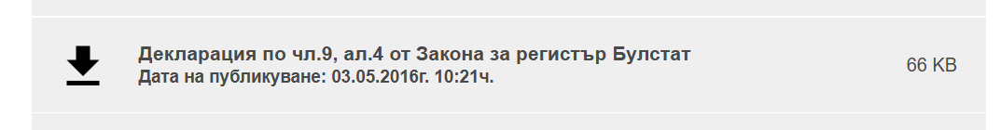
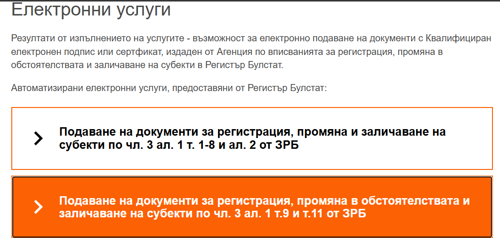
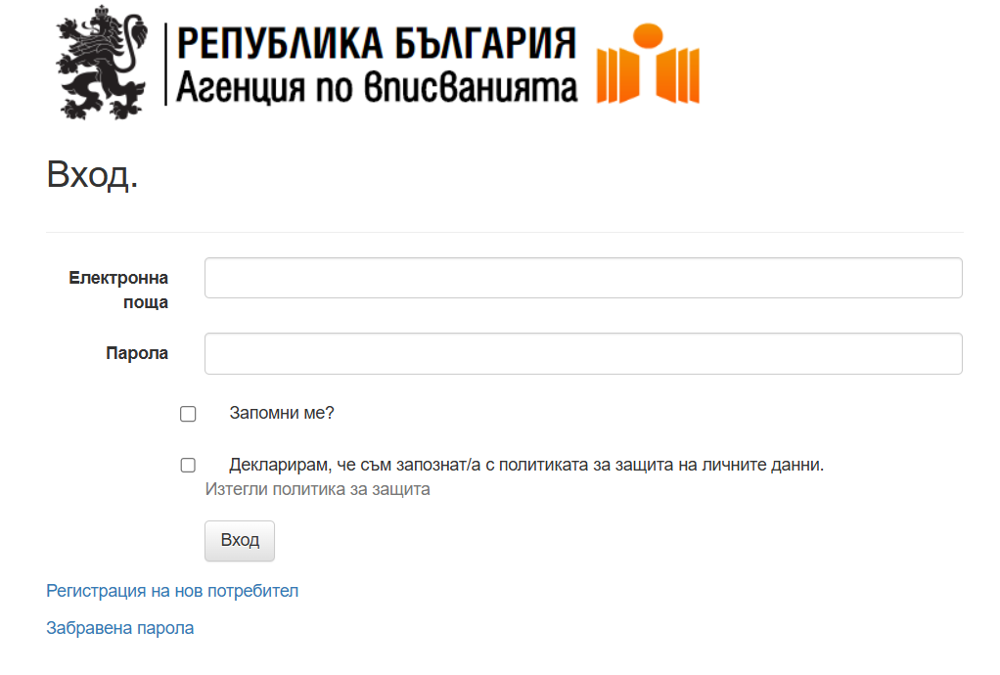
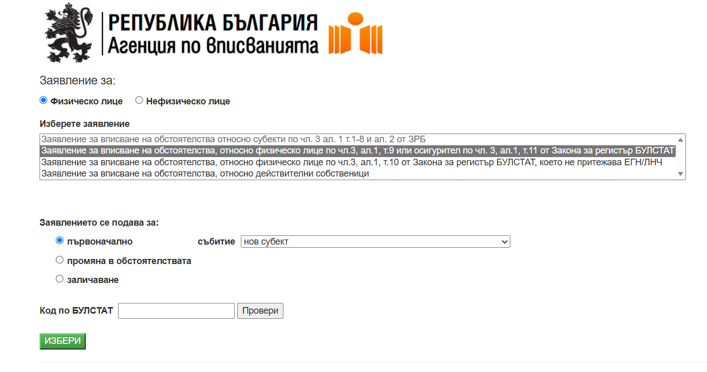
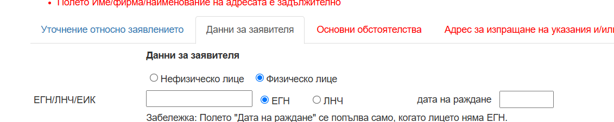
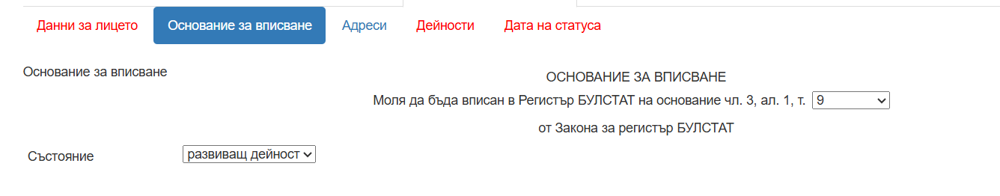
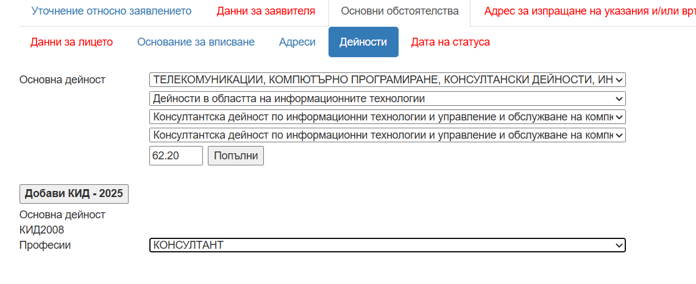
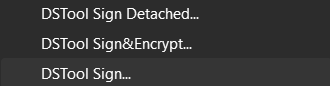
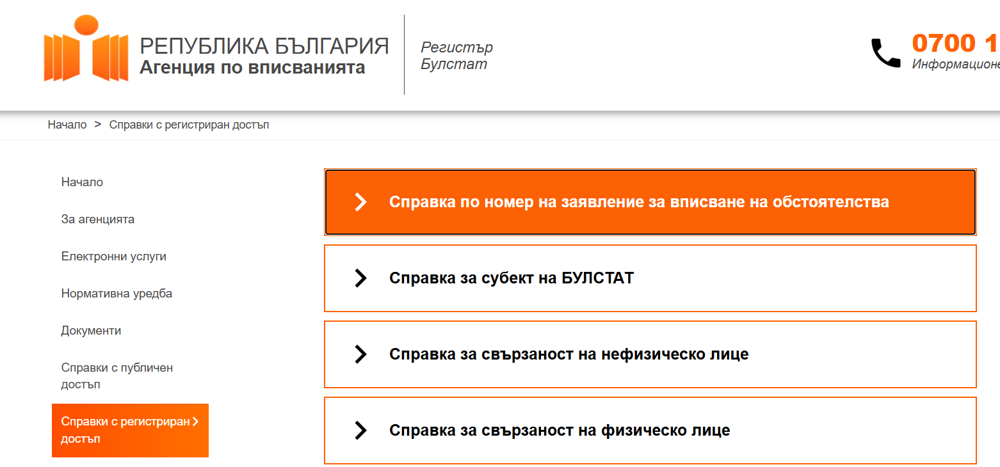
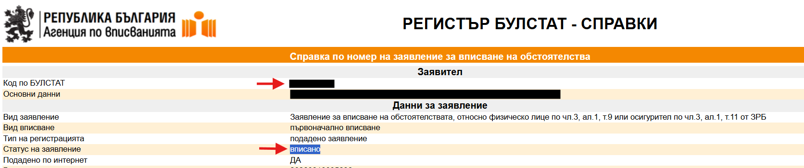

# Преминаване от трудов договор към свободна професия в България
Актуално към август 2026 г.

Все пак препоръчвам консултация със счетоводител, преди да предприемете процеса по регистрация.
Нямам счетоводен опит, така че използвайта информацията на свой риск :)

# Защо

Наложи ми се да премина от работа на трудов договор към консултантска дейност. Въпреки че има много ресурси онлайн с обяснения как се случват нещата, според мен те не са достатъчно подробни, което доста често налага ползването на счетоводител или адвокат, който да ви регистрира. Тъй като аз се регистрирах сам реших да опиша стъпките подробно и да отбележа някои тънкости.

# Предварителна подготовка

## Квалифициран електронен подпис (КЕП)

Ако нямате, задължително си извадете Квалифициран електронен подпис (КЕП). Така няма да се редите по гишета, а всичко ще стане онлайн.

## Запознайте се със законите

Прегледайте най-вече секциите за регистрация, срокове, изисквания и т.н.:

- Закон за Регистър Булстат - https://lex.bg/laws/ldoc/2135503074
- Наредба за общественото осигуряване на самоосигуряващите се лица, българските граждани на работа в чужбина и морските лица - https://www.lex.bg/index.php/laws/ldoc/-549442559
- Закон за ДДС - https://lex.bg/laws/ldoc/2135533201
- Класификация на икономическите дейности (КИД) - https://site-test.nsi.bg/sites/default/files/files/publications/KID-2025.pdf

**Важна особеност относно осигуряването:** задължени сте да се осигурявате на сумата, която получавате - няма как да я "скриете" от държавата при този режим на работа. Ако през годината сте се осигурявали на минимален доход, накрая НАП правят изравняване от дохода ви по фактури и ще ви накарат да си доплатите.

## Изберете си код на дейност по КИД

Предварително трябва да си знаете кода на дейността, която ще извършвате, от Класификацията на икономическите дейности. Препоръчвам горния PDF, тъй като има и примери какви дейности попадат в съответната категория.

Например за консултантска дейност, свързана с киберсигурност, кодът е 62.20 "Консултантска дейност по информационни технологии и управление и обслужване на компютърни средства и системи", като един от дадените примери е "консултантска дейност в областта на компютърния хардуер, софтуер и системи, включително консултантска дейност в областта на киберсигурността".

# Стъпка 1: Регистрация в Булстат

## Срокове

Регистрацията се извършва в 7-дневен срок от започване на дейност. Денят на започване на дейност е датата, която пише на договора ви с клиента.

Не може да се регистрирате предварително - направих запитване към Булстат и ми отговориха, че не е възможно в заявлението да се въведе бъдеща дата на започване. Може да подадете от деня на започване, с краен срок до 7 дни след това.

## Какви документи да подготвите

**1. Доказателства, че можете да извършвате дейността.** За да ви регистрират, е нужно да представите доказателства, че можете да извършвате дейността, за която се регистрирате. Такова доказателство може да е диплома за завършено образование, сертификати и подобни, като е нужно да бъдат на български език. Ако са на английски, не съм сигурен дали трябва легализиран превод, тъй като на мен не ми се наложи да пращам документи на друг език.

**2. Декларация за истинност на подадените документи.** Сваля се от https://www.bulstat.bg/bg/view/dokumenti - "Декларация по чл.9, ал.4 от Закона за регистър Булстат". Попълва се, подписва се и се сканира.

**3. Договорът с клиента (за всеки случай).** Възможно е да ви поискат договора като доказателство. Ако е с чуждестранен клиент, пригответе си го и на български. На мен не ми се наложи да го пращам, затова не мога да кажа със сигурност, но не намерих законово изискване преводът да бъде легализиран. За всеки случай аз го имах подготвен, като го преведох с Claude Fable, който се оказа доста добър за тази задача. Също така скрих някои лични данни и договореното заплащане, тъй като не мисля, че е нещо, което Булстат има нужда да знаят.

Намерих няколко съдебни решения, при които подписът с DocuSign съда не го приема като квалифициран подпис. За всеки случай може да се уговорите с клиента да ви прати и сканирано копие с мокър подпис, който да си го подпишете на ръка. 

## Такса

Таксата не е нужно да се плаща предварително с банков превод и не е нужно да се прикачва нареждането за превод. Накрая на процеса по регистрация има опция да платите онлайн с ePay.

## Стъпки по регистрация (трябва ви КЕП)

1) Отидете на сайта на Регистър Булстат в секция "Електронни услуги" - https://www.bulstat.bg/bg/view/elektronni-uslugi

2) Изберете "Подаване на документи за регистрация, промяна в обстоятелствата и заличаване на субекти по чл. 3 ал. 1 т.9 и т.11 от ЗРБ".

3) Ще бъдете препратени към логин форма. Има линк за регистрация на нов потребител.

4) Направете си регистрация от "Регистрация на нов потребител".

5) След успешна регистрация се логнете.

6) Изберете заявление за "Физическо лице", по чл.3, ал.1, т.9.

7) Попълнете си данните от заявлението. Ще акцентирам само на по-важните части:

- При "Данни на заявителя", ако това ви е първа регистрация по Булстат, избирате "Физическо лице". Само ако вече сте субект по Булстат, тогава трябва да се избере "Нефизическо лице" и от падащото меню има опция "Физическо лице - субект по Булстат".

- Основание за вписване е т.9.

- Въведете си дейността по категории - след попълване на падащите менюта кодът 62.20 сам се показва. Не знам дали е задължително, но въведох и код по КИД 2008 - Консултант.

8) Относно адресите е важно да знаете, че адресът за кореспонденция и адресът за извършване на дейността са **публични** и всеки може да ги провери в регистър Булстат. Тоест ако си въведете личния адрес, телефон и мейл, те ще бъдат публично видими. Това го разбрах впоследствие. Може да се коригира, като се изпрати заявление за корекция/промяна на данни. За адрес може да ползвате адреса на счетоводителя, който ползвате. За телефон и имейл предполагам, че трябва да си направите служебни такива, ако не искате да се показват публично.

9) В последния раздел ще трябва да качите:

- Сканираната, попълнена и подписана декларация за истинност
- Всички документи, които ще използвате за доказателство, че можете да извършвате дейността (в моя случай качих дипломи за магистър по Телекомуникации, бакалавър по Телекомуникации и сертификат от участие в учение по киберсигурност)
- Има ограничение от 5MB за файл.

10) Най-накрая ще бъдете препратени на страница, от която ще свалите всичко, което сте попълнили, под формата на PDF файл, и ще бъдете помолени да го подпишете. С КЕП става, като използвате DSTool Sign - ще получите файл с разширение .p7s, който трябва да качите.

11) Както писах по-горе, вече не е нужно да плащате таксата предварително и да качвате платежното нареждане. Накрая на процеса ще имате опция да платите онлайн с ePay.

12) Ще получите номер на заявлението - по този номер може да си проверявате статуса.

## След подаването

Срокът за обработка е 1 ден - до края на деня би трябвало да разберете дали сте вписани или ще получите отказ. При мен в рамките на 2 часа вече бях вписан.

Няма да получите уведомление за вписването - трябва да си проверявате статуса на заявлението или да гледате дали ще се появите в регистъра. Когато статусът стане "вписано", значи вече сте вписани в Булстат и най-отгоре ще може да си видите ЕИК кода.

Ако има проблем, ще ви изпратят инструкции за корекция или искане за допълнителна информация (например договора - виж по-горе в "Какви документи да подготвите").

# Стъпка 2: Декларация в НАП за самоосигуряващо се лице

## Срокове

В същия 7-дневен срок от започване на дейността трябва да подадете декларация в НАП, че вече сте самоосигуряващо се лице.

На различни места информацията варира - някъде пишат, че сроковете за Булстат и НАП вървят паралелно от същия ден на започване на дейността. На други пише, че срокът за НАП започва да тече чак след като получите вписване по Булстат. Не знам кое е вярното, но за всеки случай приех, че сроковете текат паралелно.

**Важно:** След като бях вписан в Булстат, отне 24 часа информацията да бъде видима и в акаунта ми в НАП. Ще се появи като втори профил и ще може да превключвате между профила ви по ЕГН и профила по ЕИК.

## Стъпки

В профила ви по ЕГН ще може да намерите услугата "Приемане на декларация за регистрация на самоосигуряващо се лице №818" - [Портал за електронни услуги на НАП](https://portal.nra.bg/details/dec-selfinsuarance).

Попълвате си данните (включително ЕИК в полето "Идентификационен номер на ЮЛ/ЕТ") и подавате.

# Стъпка 3: Регистрация по ДДС

Кога е нужна регистрация:

- Ако клиентът ви е в България, няма нужда от регистрация по ДДС, преди да надхвърлите националния праг за регистрация.
- Ако клиентът ви е чуждестранна фирма от ЕС, сте задължени още преди първата фактура да бъдете регистрирани по ДДС по чл.97а, ал.2.

## Стъпки

В НАП, чрез профила ви по ЕИК, намерете услугата за регистрация по ЗДДС. Попълнете формуляра - в моя случай клиентът беше от държава в ЕС и трябваше да избера чл.97а, ал.2.

Има вероятност да се свържат с вас от НАП и да изискат следната информация:

- Попълване на декларация и справки относно приходите от оборот за последните 2 години. Тъй като преди това съм получавал доходи само от заплата, навсякъде се попълва 0 или тире.
- ДДС номер на клиента ви (хубаво е да го имате предварително).
- Банкови извлечения за последните 2 години (става от онлайн банкирането).

# Други

## Упълномощаване на счетоводител

За да може счетоводител да ви подава всички декларации и т.н., му е нужно да може да ви представлява в профила ви в НАП. Ще трябва да имате пълномощно, заверено от нотариус. След което счетоводителят ви ще може да заяви достъп, а вие може изцяло онлайн да одобрите този достъп.

В профила по ЕИК трябва да смените имейла за контакт да бъде този на счетоводителя ви - в противен случай от НАП ще продължат да изпращат мейли до вас вместо към него. Това става от секцията "Управление на контактна информация", докато сте в профила си по ЕИК.

